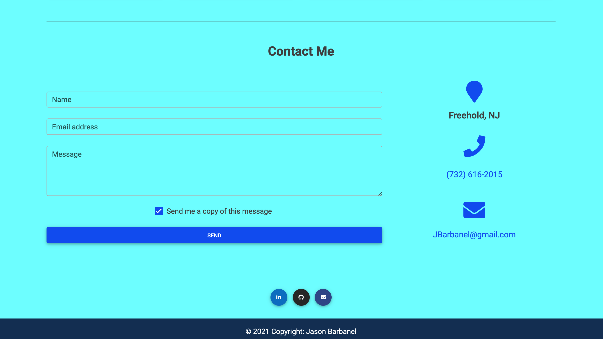

# Updated-Portfolio# 

1. [ Description. ](#desc)
2. [ Web Address. ](#web-address)
3. [ Contributions. ](#contributions)
4. [ Licensing. ](#licensing)

## 1. Description

Updated Portfolio:

I have updated my portfolio with the new skills I have learned

Features Include:

1. Displays my full name, email, and phone number

2. Links to my GitHub profile and LinkedIn profile

3. Link to a downloadable PDF of my resume

4. Displays at least 2 examples of my work which includes

    * Project title

    * Link to the deployed version

    * Link to the GitHub repository

    * Screenshot of the deployed application

5. Has a polished, mobile-responsive user interface.

Updated GitHub Profile:

1. Professional profile picture

2. Biography

3. My current location

4. Email address

5. Link to my deployed portfolio

6. At least 2 pinned repositories:

7. Follow a few of your classmates. 

8. Updated README files which include:

   * Title of app
   * Live link to deployed app
   * List of technologies used
   * 1-2 sentences explaining what the app is
   * 2-3 Screenshots / gifs of the app
   * License
   * Contact information for you and any collaborators

9. Commit history. Every pinned repository should have at least 20 commits.

Updated Resume includes:

* a heading with my name, phone number, professional email address, links to LinkedIn, portfolio and GitHub

* a technical skills section, with all programming languages and technologies listed

* 3 of my strongest projects/homework assignments with brief description, languages used, and URL

Updated LinkedIn:

A strong bio statement, a professional photo, and links to your Github and portfolio.

Issues:
you can send emails to me from the social links throughout the page but I could not get the Contact Form to send email. We would have to learn a bout PHP and we haven't yet. I liked the look and will be adding functionality at a later time.

## 2. How to Get There

### Click link to open in your browser.

[github pages site] https://jbarbss.github.io/Updated-Portfolio/

[github repository site] https://github.com/Jbarbss/Updated-Portfolio

### Deployed application screen shot

## 3. Contributions
Thank you to the following for their suggestions and insights.

Ben Durham (https://github.com/bdurham227)

Gabe Thomas (https://github.com/samohtebag)

Patrick Walker (https://github.com/pat31477)

Takuya Matsumoto (https://github.com/TakuyaMats)

## 4. Licensing

Copyright (c) 2021 Jason Barbanel

Permission is hereby granted, free of charge, to any person obtaining a copy of this software and associated documentation files (the "Software"), to deal in the Software without restriction, including without limitation the rights to use, copy, modify, merge, publish, distribute, sublicense, and/or sell copies of the Software, and to permit persons to whom the Software is furnished to do so, subject to the following conditions:

The above copyright notice and this permission notice shall be included in all copies or substantial portions of the Software.

THE SOFTWARE IS PROVIDED "AS IS", WITHOUT WARRANTY OF ANY KIND, EXPRESS OR IMPLIED, INCLUDING BUT NOT LIMITED TO THE WARRANTIES OF MERCHANTABILITY, FITNESS FOR A PARTICULAR PURPOSE AND NONINFRINGEMENT. IN NO EVENT SHALL THE AUTHORS OR COPYRIGHT HOLDERS BE LIABLE FOR ANY CLAIM, DAMAGES OR OTHER LIABILITY, WHETHER IN AN ACTION OF CONTRACT, TORT OR OTHERWISE, ARISING FROM, OUT OF OR IN CONNECTION WITH THE SOFTWARE OR THE USE OR OTHER DEALINGS IN THE SOFTWARE.